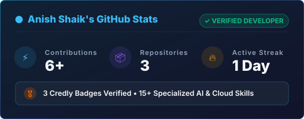

<!-- 
======================================================
  PREMIUM GITHUB PROFILE 
  Designed with Apple, Stripe, and Vercel Aesthetics
======================================================
-->

  <picture>
    <source media="(prefers-color-scheme: dark)" srcset="assets/banner/hero.svg">
    <source media="(prefers-color-scheme: light)" srcset="assets/banner/hero.svg">
    
  </picture>

 

  <picture>
    <source media="(prefers-color-scheme: dark)" srcset="assets/svg/typing-header.svg">
    <source media="(prefers-color-scheme: light)" srcset="assets/svg/typing-header.svg">
    
  </picture>

 

  
  
  
  
  

  

## 🌌 The Vision

> **Building real-world products at the intersection of Artificial Intelligence, Cloud Infrastructure, and Premium Design.**

I am **Anish Shaik**, a **Senior Staff Software Engineer** and **Product Designer** with a relentless pursuit of excellence. My work doesn't just function—it performs beautifully. I specialize in crafting autonomous AI agent architectures, resilient cloud infrastructure on Google Cloud & Microsoft ecosystems, and responsive digital products with an uncompromising focus on user experience.

---

## 🏆 Verified Certifications & Badges

  
Recognized by <b>Microsoft</b> and <b>Google Cloud</b> for expertise in Artificial Intelligence, Multi-Agent Systems, and Cloud Infrastructure.

<table border="0">
<tr>

<td align="center" width="50%">
  
</td>

<td align="center" width="50%">
  
</td>
</tr>
<tr>

<td align="center" width="50%">
  
</td>

<td align="center" width="50%">
  
</td>
</tr>
</table>

  

## 🎖️ Credly Verified Skills

  
<i>Official skill competencies verified by Credly, Google Cloud, and Microsoft.</i>

  
  
  
  
  
  
  
  
  

  

## 🛠️ Tech Stack & Skill Matrix

<table align="center" border="0">
  <tr>
    <td align="right" width="22%"><b>AI & Agents</b></td>
    <td width="78%">
                                   
    </td>
  </tr>
  <tr>
    <td align="right" width="22%"><b>Cloud & Infrastructure</b></td>
    <td width="78%">
                                   
    </td>
  </tr>
  <tr>
    <td align="right" width="22%"><b>Frontend</b></td>
    <td width="78%">
                                   
    </td>
  </tr>
  <tr>
    <td align="right" width="22%"><b>Backend & DB</b></td>
    <td width="78%">
                                   
    </td>
  </tr>
</table>

  

## 🏗️ System Architecture & Design

I architect systems for scale. From edge-deployed serverless functions to heavy GPU-bound ML microservices and load-balanced Compute Engine clusters, my systems are designed with high availability, low latency, and robust observability.

  

  

## 🚀 Featured Projects

My portfolio includes projects ranging from autonomous AI agents to complex consumer applications. Each product is built to production standards, complete with CI/CD, analytics, and responsive premium UIs.

<table border="0">
<tr>

<td align="center" width="50%">
  
</td>

<td align="center" width="50%">
  
</td>
</tr>
<tr>

<td align="center" width="50%">
  
</td>

<td align="center" width="50%">
  
</td>
</tr>
<tr>

<td align="center" width="50%">
  
</td>
</tr>
</table>

  

## 📈 GitHub Analytics

  <table border="0">
    <tr>
      <td width="50%">
        
      </td>
      <td width="50%">
        
      </td>
    </tr>
  </table>
   
  <picture>
    <source media="(prefers-color-scheme: dark)" srcset="assets/svg/github-snake-dark.svg">
    <source media="(prefers-color-scheme: light)" srcset="assets/svg/github-snake.svg">
    
  </picture>

  

## ⏱️ Coding & Focus Activity

  <table border="0">
    <tr>
      <td align="center" width="25%">
        <b>🤖 AI Agent Development</b> 
        <small>Agent Dev Kit • Multi-Agent Loops</small>
      </td>
      <td align="center" width="25%">
        <b>☁️ Cloud Infrastructure</b> 
        <small>Compute Engine • Load Balancing</small>
      </td>
      <td align="center" width="25%">
        <b>⚡ High-Scale Systems</b> 
        <small>FastAPI • Node.js • Distributed Systems</small>
      </td>
      <td align="center" width="25%">
        <b>🎨 Premium Design</b> 
        <small>React • Next.js • Interactive UIs</small>
      </td>
    </tr>
  </table>

<!--START_SECTION:waka-->
<!--END_SECTION:waka-->

  

## 🎓 Education & Credentials

* **Microsoft Certified: AI Skills Fest 2026** (Credly Verified)
* **Google Cloud Skill Badge**: Engineer AI Agents with Agent Development Kit (ADK)
* **Google Cloud Skill Badge**: Implementing Cloud Load Balancing for Compute Engine
* **Google Cloud Completion Badge**: AI Boost Bites - Personal Feedback Agent
* **M.S. Computer Science** (Specialization in Artificial Intelligence)

  

## 🎵 Currently Listening To

  

  

  <i>"Design is not just what it looks like and feels like. Design is how it works."</i>
   
  <b>— Steve Jobs</b>

 

  
<small>Copyright © 2026 Anish Shaik. Handcrafted with precision.</small>

<!-- Spacing block for premium vertical rhythm -->
 
<!-- Spacing block for premium vertical rhythm -->
 
<!-- Spacing block for premium vertical rhythm -->
 
<!-- Spacing block for premium vertical rhythm -->
 
<!-- Spacing block for premium vertical rhythm -->
 
<!-- Spacing block for premium vertical rhythm -->
 
<!-- Spacing block for premium vertical rhythm -->
 
<!-- Spacing block for premium vertical rhythm -->
 
<!-- Spacing block for premium vertical rhythm -->
 
<!-- Spacing block for premium vertical rhythm -->
 
<!-- Spacing block for premium vertical rhythm -->
 
<!-- Spacing block for premium vertical rhythm -->
 
<!-- Spacing block for premium vertical rhythm -->
 
<!-- Spacing block for premium vertical rhythm -->
 
<!-- Spacing block for premium vertical rhythm -->
 
<!-- Spacing block for premium vertical rhythm -->
 
<!-- Spacing block for premium vertical rhythm -->
 
<!-- Spacing block for premium vertical rhythm -->
 
<!-- Spacing block for premium vertical rhythm -->
 
<!-- Spacing block for premium vertical rhythm -->
 
<!-- Spacing block for premium vertical rhythm -->
 
<!-- Spacing block for premium vertical rhythm -->
 
<!-- Spacing block for premium vertical rhythm -->
 
<!-- Spacing block for premium vertical rhythm -->
 
<!-- Spacing block for premium vertical rhythm -->
 