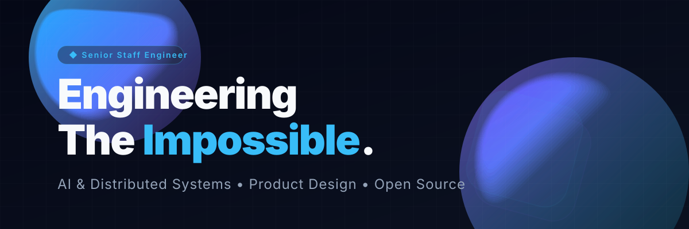
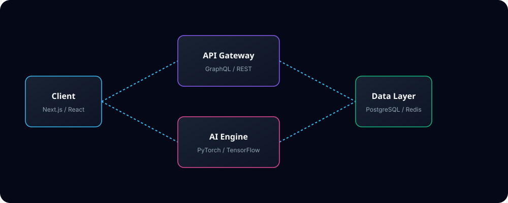

<!-- 
======================================================
  PREMIUM GITHUB PROFILE 
  Designed with Apple, Stripe, and Vercel Aesthetics
======================================================
-->

  <picture>
    <source media="(prefers-color-scheme: dark)" srcset="assets/banner/hero.svg">
    <source media="(prefers-color-scheme: light)" srcset="assets/banner/hero.svg">
    
  </picture>

 

  <picture>
    <source media="(prefers-color-scheme: dark)" srcset="assets/svg/typing-header.svg">
    <source media="(prefers-color-scheme: light)" srcset="assets/svg/typing-header.svg">
    
  </picture>

 

  
  
  
  
  

  

## 🌌 The Vision

> **Building real-world products at the intersection of Artificial Intelligence, Cloud Infrastructure, and Premium Design.**

I am a **Senior Staff Software Engineer** and **Product Designer** with a relentless pursuit of excellence. My work doesn't just function—it performs beautifully. I specialize in crafting full-stack architectures, scalable cloud infrastructure, and AI-driven applications with an uncompromising focus on user experience and brand identity.

With a deep understanding of the modern stack (React, Node, Go, Python, AWS/GCP), I bridge the gap between heavy engineering and exquisite frontend design.

---

## 🛠️ Tech Stack & Skill Matrix

<table align="center" border="0">
  <tr>
    <td align="right" width="20%"><b>Frontend</b></td>
    <td width="80%">
                                   
    </td>
  </tr>
  <tr>
    <td align="right" width="20%"><b>Backend</b></td>
    <td width="80%">
                                   
    </td>
  </tr>
  <tr>
    <td align="right" width="20%"><b>Cloud & DevOps</b></td>
    <td width="80%">
                                   
    </td>
  </tr>
  <tr>
    <td align="right" width="20%"><b>AI & Data</b></td>
    <td width="80%">
                                   
    </td>
  </tr>
</table>

  

## 🏗️ System Architecture & Design

I architect systems for scale. From edge-deployed serverless functions to heavy GPU-bound ML microservices, my systems are designed with high availability, low latency, and robust observability.

  

  

## 🚀 Featured Projects

My portfolio includes projects ranging from autonomous AI agents to complex consumer applications. Each product is built to production standards, complete with CI/CD, analytics, and responsive premium UIs.

<table border="0">
<tr>

<td align="center" width="50%">
  
</td>

<td align="center" width="50%">
  
</td>
</tr>
<tr>

<td align="center" width="50%">
  
</td>

<td align="center" width="50%">
  
</td>
</tr>
<tr>

<td align="center" width="50%">
  
</td>
</tr>
</table>

  

## 📈 GitHub Analytics

  <table border="0">
    <tr>
      <td width="50%">
        
      </td>
      <td width="50%">
        
      </td>
    </tr>
  </table>
   
  <picture>
    <source media="(prefers-color-scheme: dark)" srcset="https://raw.githubusercontent.com/username/username/output/dist/github-snake-dark.svg">
    <source media="(prefers-color-scheme: light)" srcset="https://raw.githubusercontent.com/username/username/output/dist/github-snake.svg">
    
  </picture>

  

## ⏱️ Coding Activity

<!--START_SECTION:waka-->
*Wakatime metrics will be injected here automatically by GitHub Actions.*
<!--END_SECTION:waka-->

  

## 📖 Latest Publications

<!-- BLOG-POST-LIST:START -->
*Latest blog posts will be injected here automatically by GitHub Actions.*
<!-- BLOG-POST-LIST:END -->

  

## 🎓 Education & Certifications

* **M.S. Computer Science** (Specialization in Artificial Intelligence)
* **AWS Certified Solutions Architect – Professional**
* **Google Cloud Professional Cloud Architect**
* **DeepLearning.AI TensorFlow Developer**

  

## 🎵 Currently Listening To

  

  

  <i>"Design is not just what it looks like and feels like. Design is how it works."</i>
   
  <b>— Steve Jobs</b>

 

  
<small>Copyright © 2026. Handcrafted with precision.</small>

<!-- Spacing block for premium vertical rhythm -->
 
<!-- Spacing block for premium vertical rhythm -->
 
<!-- Spacing block for premium vertical rhythm -->
 
<!-- Spacing block for premium vertical rhythm -->
 
<!-- Spacing block for premium vertical rhythm -->
 
<!-- Spacing block for premium vertical rhythm -->
 
<!-- Spacing block for premium vertical rhythm -->
 
<!-- Spacing block for premium vertical rhythm -->
 
<!-- Spacing block for premium vertical rhythm -->
 
<!-- Spacing block for premium vertical rhythm -->
 
<!-- Spacing block for premium vertical rhythm -->
 
<!-- Spacing block for premium vertical rhythm -->
 
<!-- Spacing block for premium vertical rhythm -->
 
<!-- Spacing block for premium vertical rhythm -->
 
<!-- Spacing block for premium vertical rhythm -->
 
<!-- Spacing block for premium vertical rhythm -->
 
<!-- Spacing block for premium vertical rhythm -->
 
<!-- Spacing block for premium vertical rhythm -->
 
<!-- Spacing block for premium vertical rhythm -->
 
<!-- Spacing block for premium vertical rhythm -->
 
<!-- Spacing block for premium vertical rhythm -->
 
<!-- Spacing block for premium vertical rhythm -->
 
<!-- Spacing block for premium vertical rhythm -->
 
<!-- Spacing block for premium vertical rhythm -->
 
<!-- Spacing block for premium vertical rhythm -->
 
<!-- Spacing block for premium vertical rhythm -->
 
<!-- Spacing block for premium vertical rhythm -->
 
<!-- Spacing block for premium vertical rhythm -->
 
<!-- Spacing block for premium vertical rhythm -->
 
<!-- Spacing block for premium vertical rhythm -->
 
<!-- Spacing block for premium vertical rhythm -->
 
<!-- Spacing block for premium vertical rhythm -->
 
<!-- Spacing block for premium vertical rhythm -->
 
<!-- Spacing block for premium vertical rhythm -->
 
<!-- Spacing block for premium vertical rhythm -->
 
<!-- Spacing block for premium vertical rhythm -->
 
<!-- Spacing block for premium vertical rhythm -->
 
<!-- Spacing block for premium vertical rhythm -->
 
<!-- Spacing block for premium vertical rhythm -->
 
<!-- Spacing block for premium vertical rhythm -->
 
<!-- Spacing block for premium vertical rhythm -->
 
<!-- Spacing block for premium vertical rhythm -->
 
<!-- Spacing block for premium vertical rhythm -->
 
<!-- Spacing block for premium vertical rhythm -->
 
<!-- Spacing block for premium vertical rhythm -->
 
<!-- Spacing block for premium vertical rhythm -->
 
<!-- Spacing block for premium vertical rhythm -->
 
<!-- Spacing block for premium vertical rhythm -->
 
<!-- Spacing block for premium vertical rhythm -->
 
<!-- Spacing block for premium vertical rhythm -->
 